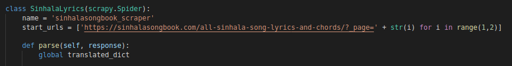

# Sinhala-Lyrics-Crawler
This is a simple  web scraper made using python scrapy to crawl sinhala lyrics site.

## Getting Started
1. Install python and pip version 3
2. Install required python packages by running the following command in the project home directory.
  `$ pip install -r requirements.txt`
  > You may create a python virtual enviroment and install dependencies there
3. Setup below configurations in the `sinhalalyrics/settings.py` file as required.
```
# Configure a delay for requests for the same website (default: 0)
DOWNLOAD_DELAY = 9

# The download delay setting will honor only one of:
CONCURRENT_REQUESTS_PER_DOMAIN = 2
CONCURRENT_REQUESTS_PER_IP = 1

# Disable cookies (enabled by default)
COOKIES_ENABLED = False
```
> You may add additional configurations also ([see here](https://docs.scrapy.org/en/latest/topics/settings.html)).
4. If you want to send documents directly to ElasticSearch, uncomment and change below configurations in `sinhalalyrics/settings.py`.
```
# Configure ScrapeElasticSearch
ITEM_PIPELINES = {
    'scrapyelasticsearch.scrapyelasticsearch.ElasticSearchPipeline': 500
}

ELASTICSEARCH_SERVERS = ['http://127.0.0.1:9200']
ELASTICSEARCH_INDEX = 'sinhala_lyrics'
ELASTICSEARCH_TYPE = 'items'
ELASTICSEARCH_UNIQ_KEY = 'url'
```
5. Change the page range in `sinhalalyrics/spiders/lyric_scrape.py` file as required.


## Running the Crawler
Go to `sinhalalyrics` folder and run the following command.

`$ scrapy crawl sinhalasongbook_scraper -o <filename>.json`

## Data Format
Spider will crawl the sinhalasongs site and scrape the below fields.
1. `url`: url of the lyric. Uses as a unique key for elasticsearch index
2. `songName`: name of the song
3. `artist`: list containing artists
4. `genre`: list containing genres
5. `lyricWriter`: list containing lyric writers
6. `musicDirector`: list containing music directors
7. `key`: key of the song
8. `beat`: beat of the song
9. `views`: no of views for the song in original site
10. `shares`: no of shares for the song in original site
11. `lyric`: lyric (each line seperated by a `\n` character)
> Some of the above fields may empty in the scraped result due to different html formats in the website.
